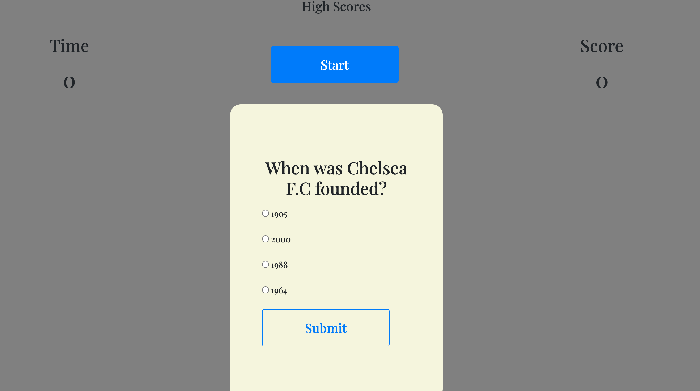
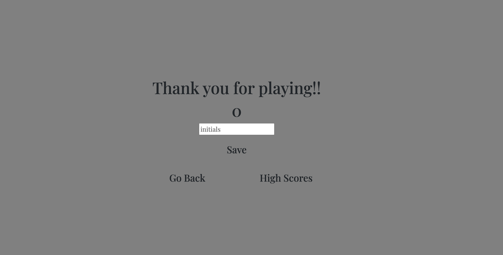

# chelsea-quiz
In this challenge we were given the task to create a quiz that can keep track of your high score using local storage.

##  Instructions
- Generate questions for the user
- Save the users score when they've completed the quiz
- Give the user to check their scores on a score board

## Process
- We were not given any starter code
- Html, css, and javscript started from scrath
- Created 3 different HTML's; one for the intial  page, the end page and the highscores page.
- Javascript was created for each one of them as well. So they had its own code.
- To save time I utilized one css file for all three HTMLs.
- Bootstrap and google Fonts was used as well.
- Lastly i used API to get the scores from the local  storage. 

## References and sources
-https://getbootstrap.com/docs/5.3/components/buttons/
-https://fonts.google.com/
-https://www.funtrivia.com/en/Sports/Chelsea-7251.html
-https://www.w3schools.com/
-https://developer.mozilla.org/en-US/docs/Web/JavaScript
-https://codepen.io/

## Issues
- Some of the javascript  gave me huge trouble.
- Changes were commited all at once instead of one by one.

